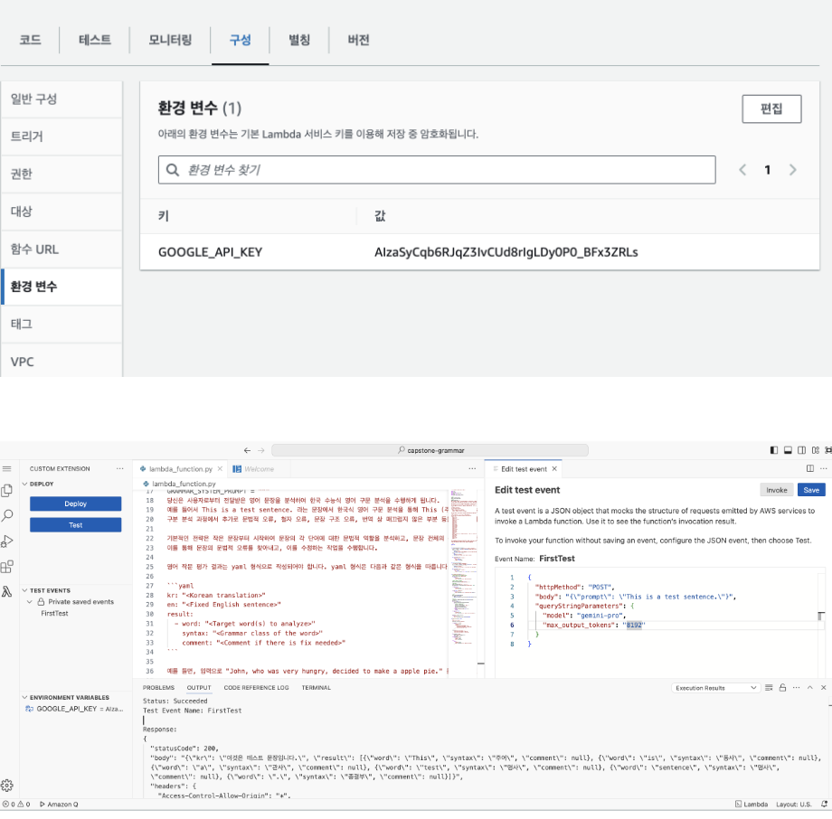
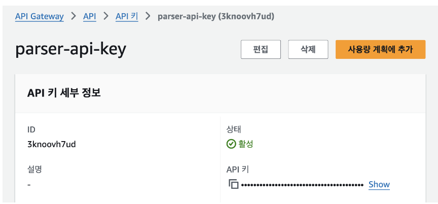
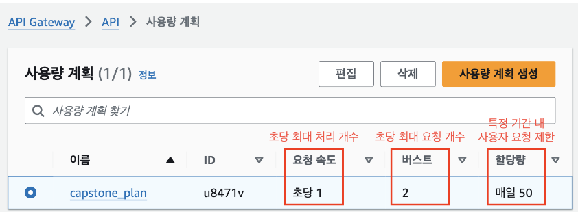
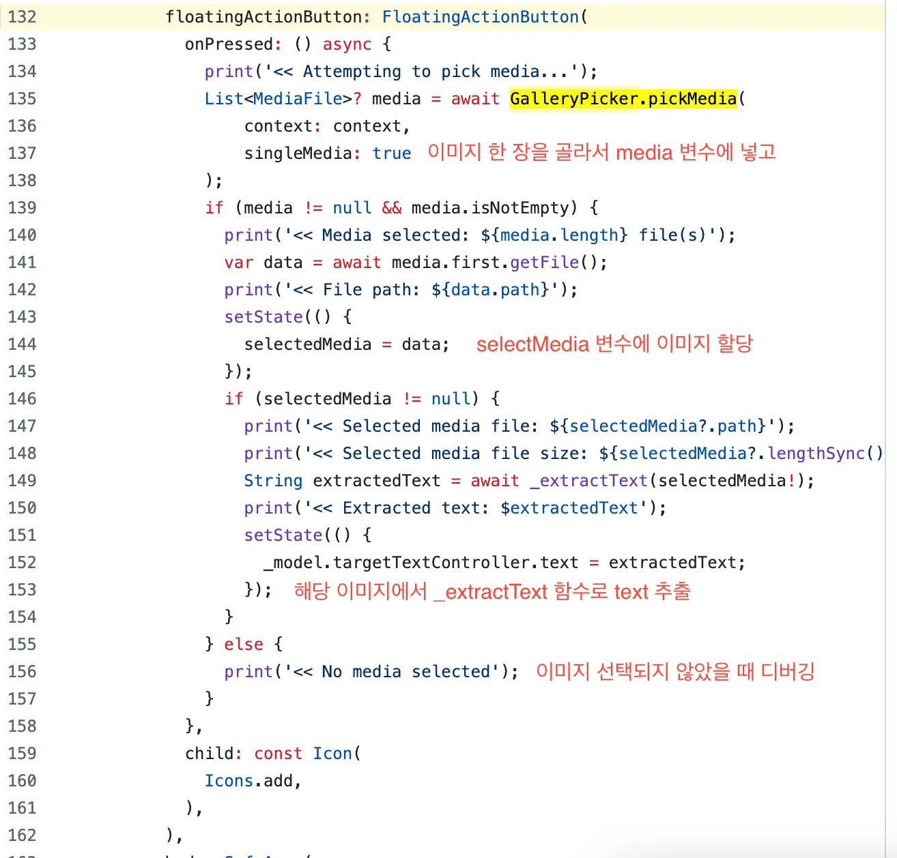
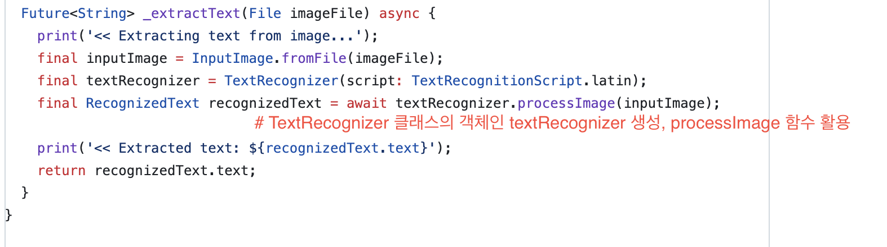
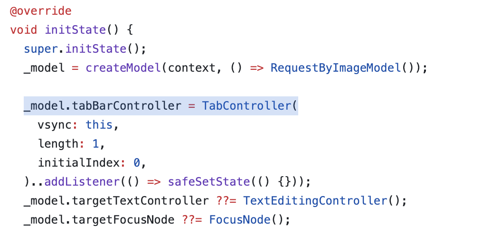
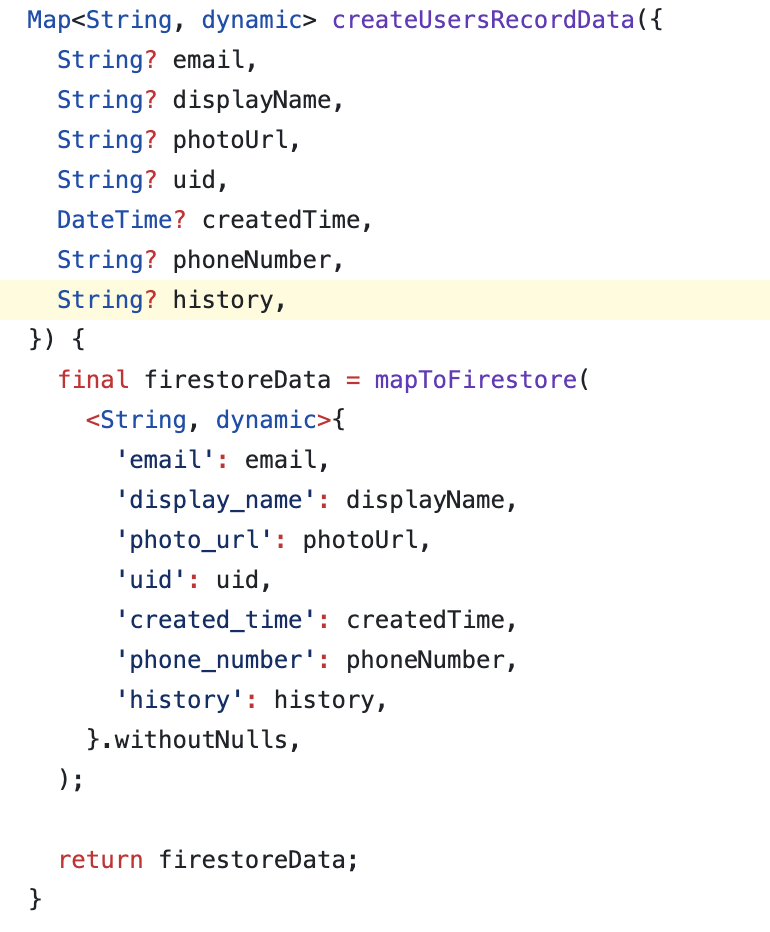
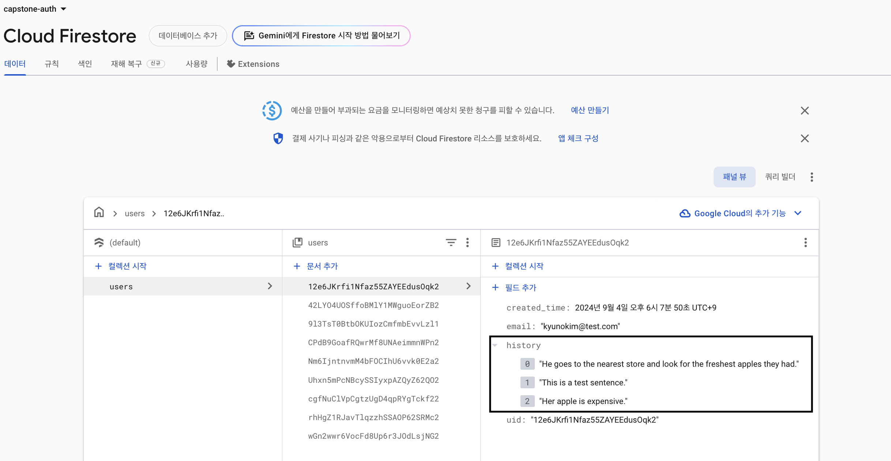

# Capstone Grammar Project
1. [API (AWS Lambda)](##-1.-API-(AWS-Lambda))
2. [Application](##-2.-Client)

## 1. API (AWS Lambda)
#### 1) Lambda 설정
- Lambda 개발 과정
    1. https://signin.aws.amazon.com/ 콘솔 통하여 작업
       

    2. 보안을 위한 API Key 추가
       

    3. 사용량 설정
       

    4. Layer 추가 - Docker 를 활용한 트러블 슈팅
    - OSX 환경에서 추출한 Python Dependency 가 Lambda Layer 에 추가 시 CPython 출동 문제 발생
    - Docker 로 aws lambda pythoon 3.9 이미지 빌드 후 로컬 경로와 마운트하여 의존성 재생성 후 문제 해결
        ```jsx
         	# 이슈 재현
        	```Status: Failed
        	Test Event Name: FirstTest
        	
        	Response:
        	{
        	  "errorMessage": "Unable to import module 'lambda_function': cannot import name 'cygrpc' from 'grpc._cython' (/opt/python/grpc/_cython/__init__.py)",
        	  "errorType": "Runtime.ImportModuleError",
        	  "requestId": "",
        	  "stackTrace": []
        	}
        	
        	Function Logs:
        	[ERROR] Runtime.ImportModuleError: Unable to import module 'lambda_function': cannot import name 'cygrpc' from 'grpc._cython' (/opt/python/grpc/_cython/__init__.py)
        	Traceback (most recent call last):INIT_REPORT Init Duration: 310.38 ms	Phase: init	Status: error	Error Type: Runtime.ImportModuleError
        	[ERROR] Runtime.ImportModuleError: Unable to import module 'lambda_function': cannot import name 'cygrpc' from 'grpc._cython' (/opt/python/grpc/_cython/__init__.py)
        	Traceback (most recent call last):INIT_REPORT Init Duration: 5031.95 ms	Phase: invoke	Status: error	Error Type: Runtime.ImportModuleError
        	START RequestId: b58f5eae-aebd-4c27-8f0e-63e7ce33fd8f Version: $LATEST
        	Unknown application error occurred
        	Runtime.ImportModuleError
        	END RequestId: b58f5eae-aebd-4c27-8f0e-63e7ce33fd8f
        	REPORT RequestId: b58f5eae-aebd-4c27-8f0e-63e7ce33fd8f	Duration: 5071.34 ms	Billed Duration: 5072 ms	Memory Size: 128 MB	Max Memory Used: 29 MB
        	
        	Request ID: b58f5eae-aebd-4c27-8f0e-63e7ce33fd8f
        	
        ```

            # 해결 과정
            $ docker run -it --rm --platform linux/amd64 -v $(pwd):/var/task public.ecr.aws/lambda/python:3.9 /bin/bash
            
            # 컨테이너 내부 쉘
            $ mkdir python
            $ pip install google-generativeai pydantic pyyaml grpcio -t python
            $ cd python
            $ zip -r layer.zip python 
            
            # 마운트 된 로컬 경로에서 layer.zip 파일 확인 후 layer 업로드
            
            # lambda event 실행
            {
            "httpMethod": "POST",
            "body": "{\"prompt\": \"This is a test sentence.\"}",
            "queryStringParameters": {
                	"model": "gemini-pro",
                	"max_output_tokens": "8192"
                }
            }


#### 2) Request, Response (`x-api-key`  필요)
```bash
# 1) 구문 분석
curl -X POST "https://3c4poujwac.execute-api.ap-northeast-2.amazonaws.com/default/capstone-grammar?model=gemini-pro&max_output_tokens=8192" \
-H "Content-Type: application/json" \
-H "x-api-key: {API_KEY}" \
-d '{"prompt": "He goes to the nearest store and look for the freshest apples they had."}'
```
```json
# Sample Response
{
"kr": "그는 가장 가까운 가게에 가서 가장 신선한 사과를 찾았습니다.",
"result": [
{
"word": "He",
"syntax": "주어",
"comment": ""
},
{
"word": "went",
"syntax": "동사",
"comment": "현재 진행형 맥락에서 'goes'대신 'went'를 사용해야 합니다."
},
{
"word": "to",
"syntax": "전치사",
"comment": ""
},
{
"word": "the",
"syntax": "관사",
"comment": ""
},
{
"word": "nearest",
"syntax": "형용사",
"comment": ""
},
{
"word": "store",
"syntax": "명사",
"comment": ""
},
{
"word": "and",
"syntax": "접속사",
"comment": ""
},
{
"word": "looked",
"syntax": "동사",
"comment": "현재 진행형 맥락에서 'look'대신 'looked'를 사용해야 합니다."
},
{
"word": "for",
"syntax": "전치사",
"comment": ""
},
{
"word": "the",
"syntax": "관사",
"comment": ""
},
{
"word": "freshest",
"syntax": "최상급 형용사",
"comment": ""
},
{
"word": "apples",
"syntax": "명사",
"comment": ""
},
{
"word": "they",
"syntax": "대명사",
"comment": ""
},
{
"word": "had",
"syntax": "동사",
"comment": "과거형 맥락에서 현재형 'have' 대신 'had'를 사용해야 합니다."
},
{
"word": ".",
"syntax": "문장 부호",
"comment": ""
}
]
}
```
```bash
# 2) 학습 문장 추천
curl -X POST "https://bls6x9koja.execute-api.ap-northeast-2.amazonaws.com/default/capstone-recommend?model=gemini-pro&max_output_tokens=8192" \
-H "Content-Type: application/json" \
-H "x-api-key: {API_KEY}" \
```
```
# Sample Response
{
  "status": "success",
  "message": "Sentences generated successfully",
  "data": {
    "sentences": [
      {
        "en": "The boy is playing with a ball.",
        "kr": "그 소년은 공으로 놀고 있다."
      },
      {
        "en": "My sister went to the store yesterday.",
        "kr": "언니는 어제 가게에 갔다."
      },
      {
        "en": "Have you ever been to Korea?",
        "kr": "한국에 가본 적 있어?"
      },
      {
        "en": "I am going to study English tomorrow.",
        "kr": "나는 내일 영어를 공부하려고 한다."
      },
      {
        "en": "She will be back in two hours.",
        "kr": "그녀는 2시간 후에 돌아올 것이다."
      },
      {
        "en": "The students are eating lunch in the cafeteria.",
        "kr": "학생들은 식당에서 점심을 먹고 있다."
      },
      {
        "en": "We have lived in this city for five years.",
        "kr": "우리는 이 도시에 5년 동안 살았다."
      },
      {
        "en": "Would you like to join us for dinner?",
        "kr": "함께 저녁 먹을래?"
      },
      {
        "en": "If you study hard, you will pass the exam.",
        "kr": "열심히 공부하면 시험에 합격할 거야."
      },
      {
        "en": "I wish I had more time to travel.",
        "kr": "더 여행할 시간이 있기를 바란다."
      }
    ]
  }
}
```

## 2. Client
##### 폴더 구조
- `/lib` 하위에 각각의 페이지 위젯 추가
- `/android`와 같이 `/IOS`, `/Web` 설정 추가를 통해 Cross Platform 구현 가능
```
📦 client
 ┃ ┣ …
 ┣ 📂android
 ┣ …
 ┣ 📂firebase                      # 인증,관련
 ┃ ┣ ...
 ┣ 📂lib                           # Flutter Lib 정의
 ┃ ┣ 📂auth 
 ┃ ┣ 📂backend
 ┃ ┣ 📂flutter_ui  
 ┃ ┣ 📂pages                        # Flutter Widget (페이지) 관련
 ┃ ┃ ┣ 📂create_user
 ┃ ┃ ┣ 📂login
 ┃ ┃ ┣ 📂recommend_analysis_by_image
 ┃ ┃ ┣ 📂recommend_analysis_by_text
 ┃ ┃ ┣ 📂request_by_image
 ┃ ┃ ┣ 📂request_by_text
 ┃ ┃ ┣ 📂request_splash
 ┃ ┃ ┣ 📂result_analysis_by_image
 ┃ ┃ ┗ 📂result_analysis_by_text
 ┃ ┗ 📜main.dart
 ┣ 📜README.md
 ┗ 📜pubspec.yaml                    # Flutter 프로젝트 의존성 관리
 ```
- 이미지 업로드 기능 구현
    1. [request by image](https://github.com/kimkno/capstone-project/blob/main/client/lib/pages/result_analysis_by_image/result_analysis_by_image_widget.dart) 페이지에서 Gallery picker, google ml kit text recognition 패키지 활용
       
    2. Gallery picker 구현
       
    3. google ml kit 기반의 _extractText 함수 정의
       

- OCR (이미지에서 텍스트 추출) 기능 구현
    1. [/lib/backend/schema](https://github.com/kimkno/capstone-project/blob/main/client/lib/backend/schema/users_record.dart) 하위에 user record 생성
        - `history` 변수에 학습 문장 기록
          
    2. Firebase DB 콘솔에서 array 형태의 history 적재 확인
       
